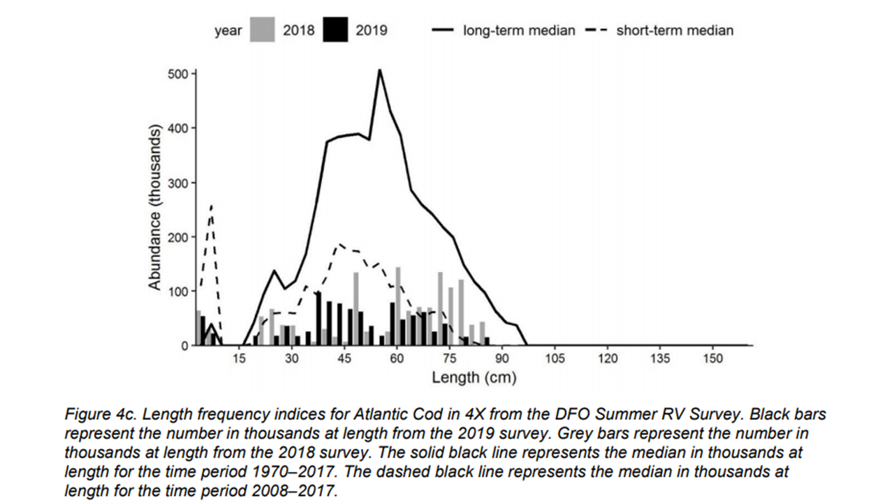
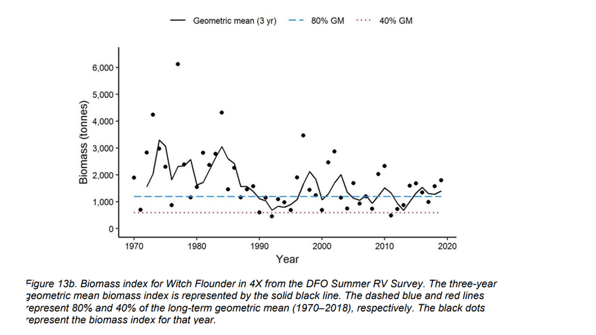
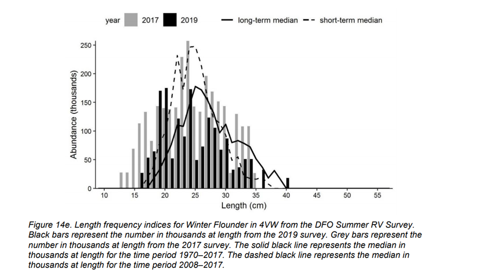
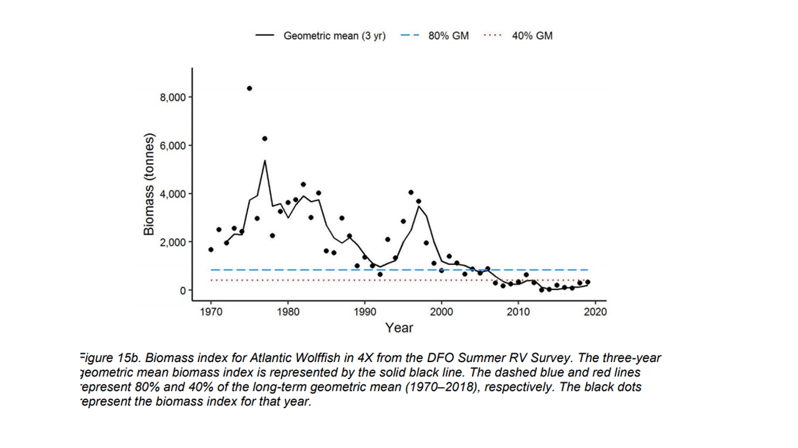

# Analysis
\extrafloats{100}
The stratified random survey design ensures that sampling takes places throughout the range covered by the survey. The strata were originally selected to represent different depths and habitats. Sampling occurs at randomly selected stations within all strata. The data are averaged within each stratum, weighted by stratum area and then summed over all appropriate strata for each stock. While this ensures that sampling is representative of the entire area, low sampling intensity means that there is high variability, particularly for stocks that are highly aggregated or that inhabit only a small part of the entire survey area; single data points in the biomass series should be interpreted with caution as large inter-annual changes could simply reflect variability in the data rather than changes in population abundance. Comparisons between the long-term and short-term averages may be more useful for representing the relative status of the population. Large inter-annual changes could also reflect the appearance of a strong year-class, or, conversely the impact of a single large tow; thus, biomass indices should be interpreted with reference to the length-frequency data and the distribution of catches to see if there are other data to aid interpretation.

The time series of survey biomass indices and the three-year (3-yr) running geometric mean are compared to 40% and 80% of the long-term geometric mean (GM) to provide context for biomass levels. The geometric mean was selected for these comparisons to reduce the impact of very high values observed in some years. The values are presented in Table 1. Information on the calculation of these indices is contained in @StoneGross2012. This can also be used as an indication of recruitment strength for species such as Haddock where recruitment pulses are apparent in the length frequency.

Of note in the data, particularly for Cod and Haddock, is the increased abundance of young-of the-year fish (Age 0) in recent years. The short-term median length frequency shows a strong mode at <10 cm for both Cod and Haddock. This is not thought to be indicative of stronger recent recruitment. Rather, this likely reflects earlier spawning and, thus, these fish are available to the July survey in recent years, when in the past they would have still been in the pelagic phase in July.

The total biomass index for 4X shows high inter-annual variability but no clear trend over time (Figure 3a). 

The large drop in biomass from 2018–2019 reflects lower catches for most demersal species. In 4W, demersal fish biomass increased in the 1980s, but, in the early 1990s dropped back to the level seen in the 1970s (Figure 3b).

In 4V, the demersal fish biomass dropped in the 1990s and has remained low since then (Figure 3c).

In 4V, Atlantic Cod and American Plaice comprised a large part of the biomass index in the 1970s and 1980s; both have experienced large declines (Figure 3c). Redfish did not experience the same drop in biomass and are the largest contributors to the 4V biomass indices in the last decade. While additional species, including Thorny Skate, White Hake, and Yellowtail Flounder have also declined since the 1980s in 4V, there are no demersal fish species that have experienced a large increase in biomass over time, so the overall index has remained low since the early 1990s. 

In 4W, increases in Atlantic Cod, Haddock and redfish led to the increase in biomass in the 1980s (Figure 3b). Biomass indices for Atlantic Cod and redfish dropped to very low levels in 4W by the 1990s and were responsible for most of the overall decline in biomass. Haddock biomass has declined in 4W since about 2010, and total demersal fish biomass in recent years has been the lowest in the time series. 

In 4X, Spiny Dogfish, redfish, and Haddock have made up the bulk of the demersal fish biomass index throughout the time series (Figure 3a). While Cod and Thorny Skate have clearly declined over time, their combined biomass did not represent a large part of the total (12% in the 1970s). These declines are balanced by increases for other species, so, unlike 4V or 4W, there has been no general decline in demersal fish biomass over time.

Changes in biomass indices from one year to the next for individual species should be interpreted cautiously. For those species where a population model is used, the inter-annual variability in population biomass estimates is lower than the variability in survey estimates. Additional information from commercial landings and age composition can help in interpreting survey data. The running 3-yr geometric mean may be a better indicator of biomass trends.

(ref:caption4-fig-biomass4X) Biomass indices for the top ten demersal fish species (bars) in 4W and for all other demersal fish species combined. Refer to Figure 1 for NAFO Divisions within the Maritimes Region. 
```{r 4-fig-biomass4X, fig.cap="(ref:caption4-fig-biomass4X)"}

```
(ref:caption5-fig-biomass4W) Biomass indices for the top ten demersal fish species (bars) in 4X and for all other demersal fish species combined. Refer to Figure 1 for NAFO Divisions within the Maritimes Region. 
```{r 5-fig-biomass4W, fig.cap="(ref:caption5-fig-biomass4W)"}

```
(ref:caption6-fig-biomass4V) Biomass indices for the top ten demersal fish species (bars) in 4V and for all other demersal fish species combined. Refer to Figure 1 for NAFO divisions within the Maritimes Region. 
```{r 6-fig-biomass4V, fig.cap="(ref:caption6-fig-biomass4V)"}

```
\clearpage

(ref:caption3-biomassindices) DFO Summer Research Vessel Survey biomass indices (tonnes) for species by stock/region for 2017, 2018, 2019, current 3-yr Geometric Mean (GM) biomass index, and 40% and 80% of the long-term GM biomass index (1970–2018). NA: Indices not available due to reduced spatial coverage of the 2018 survey. For Silver Hake and Red Hake, the long-term average is 1982–2016.
```{r read-tab-biomass}
biomass.tab <- read.csv("./tables/biomassindices.csv")
colnames(biomass.tab) <- c('Stock/Region','2017','2018', '2019','Current 3-yr GM', "40\\% Long-term GM", "80\\% Long-term GM")
```
\begin{landscapepage}
```{r tab-biomass-species}
csas_table(biomass.tab, 
           format = "latex",
           caption = "(ref:caption3-biomassindices)")
```
\end{landscapepage}


## Atlantic Cod

The largest Atlantic Cod (_Gadus morhua_) catches came from Georges Bank and Banquereau. There were no catches >50 kg in 4X or 4Vn in 2019; the biomass indices are the lowest in the time series in both areas and indices at length are below both long- and short-term medians for most lengths. The biomass index in 4VsW for 2019 is similar to 2017; in both years, abundance indices for larger cod are above the short-term medians.

(ref:caption7-map-cod) Biomass indices for the top ten demersal fish species (bars) in 4W and for all other demersal fish species combined. Refer to Figure 1 for NAFO Divisions within the Maritimes Region. 
```{r 7-map-cod, fig.cap="(ref:caption7-map-cod)"}

```

(ref:caption8-fig-cod-biomass4X) Biomass index for Atlantic Cod in 4X from the DFO Summer RV Survey. The three-year geometric mean biomass index is represented by the solid black line. The dashed blue and red lines represent 80% and 40% of the long-term geometric mean (1970–2018), respectively. The black dots represent the biomass index for that year. 
```{r 8-fig-cod-biomass4X, fig.cap="(ref:caption8-fig-cod-biomass4X)"}

```

(ref:9-fig-cod-lengthfreq4X) Length frequency indices for Atlantic Cod in 4X from the DFO Summer RV Survey. Black bars represent the number in thousands at length from the 2019 survey. Grey bars represent the number in thousands at length from the 2018 survey. The solid black line represents the median in thousands at length for the time period 1970–2017. The dashed black line represents the median in thousands at length for the time period 2008–2017. 
```{r 9-fig-cod-lengthfreq4X, fig.cap="(ref:caption9-fig-cod-lengthfreq4X)"}

```

(ref:caption10-fig-cod-biomass4VsW) Biomass index for Atlantic Cod in 4VsW from the DFO Summer RV Survey. The three-year geometric mean biomass index is represented by the solid black line. The dashed blue and red lines represent 80% and 40% of the long-term geometric mean (1970–2017), respectively. The black dots represent the biomass index for that year. 
```{r 10-fig-cod-biomass4VsW, fig.cap="(ref:caption10-fig-cod-biomass4VsW)"}

```

(ref:caption11-fig-cod-lengthfreq4VsW) Length frequency indices for Atlantic Cod in 4VsW from the DFO Summer RV Survey. Black bars represent the number in thousands at length from the 2019 survey. Grey bars represent the number in thousands at length from the 2017 survey. The solid black line represents the median in thousands at length for the time period 1970–2017. The dashed black line represents the median in thousands at length for the time period 2008–2017. 
```{r 11-fig-cod-lengthfreq4VsW, fig.cap="(ref:caption11-fig-cod-lengthfreq4VsW)"}

```

(ref:caption12-fig-cod-biomass4Vn) Biomass index for Atlantic Cod in 4Vn from the DFO Summer RV Survey. The three-year geometric mean biomass index is represented by the solid black line. The dashed blue and red lines represent 80% and 40% of the long-term geometric mean (1970–2017), respectively. The black dots represent the biomass index for that year. 
```{r 12-fig-cod-biomass4Vn, fig.cap="(ref:caption12-fig-cod-biomass4Vn)"}

```

(ref:caption13-fig-cod-lengthfreq4Vn)  Length frequency indices for Atlantic Cod in 4Vn from the DFO Summer RV Survey. Black bars represent the number in thousands at length from the 2019 survey. Grey bars represent the number in thousands at length from the 2017 survey. The solid black line represents the median in thousands at length for the time period 1970–2017. The dashed black line represents the median in thousands at length for the time period 2008–2017. 
```{r 13-fig-cod-lengthfreq4Vn, fig.cap="(ref:caption13-fig-cod-lengthfreq4Vn)"}

```
\clearpage

## Haddock

There were very few sets where the catch of Haddock (_Melanogrammus aeglefinus_) exceeded 100 kg in 4X in 2019. While Haddock were caught in almost every set in 4X, the biomass index was the lowest since 1994. In 2019, there was no indication of strong recruitment and the numbers at length were generally below the short-term median at all lengths.

In 4VW, the biomass index was among the lowest in the time series. As in 4X, the numbers at length were generally below the short-term median at all lengths.

(ref:caption14-map-haddock) Distribution of Haddock catches during the 2019 DFO Summer RV Survey. Zero catch is represented by the + symbol. Black circles represent catches. The circle area is proportional to the catch size. 
```{r 14-map-haddock, fig.cap="(ref:caption14-map-haddock)"}

```

(ref:caption15-fig-haddock-biomass4X) Biomass index for Haddock in 4X from the DFO Summer RV Survey. The three-year geometric mean biomass index is represented by the solid black line. The dashed blue and red lines represent 80% and 40% of the long-term geometric mean (1970–2018), respectively. The black dots represent the biomass index for that year. 
```{r 15-fig-haddock-biomass4X, fig.cap="(ref:caption15-fig-haddock-biomass4X)"}

```

(ref:caption16-fig-haddock-lengthfreq4X) Length frequency indices for Haddock in 4X from the DFO Summer RV Survey. Black bars represent the number in thousands at length from the 2019 survey. Grey bars represent the number in thousands at length from the 2018 survey. The solid black line represents the median in thousands at length for the time period 1970–2017. The dashed black line represents the median in thousands at
length for the time period 2008–2017.
```{r 16-fig-haddock-lengthfreq4X, fig.cap="(ref:caption16-fig-haddock-lengthfreq4X)"}

```

(ref:caption17-fig-haddock-biomass4VW)  Biomass index for Haddock in 4VW from the DFO Summer RV Survey. The three-year geometric mean biomass index is represented by the solid black line. The dashed blue and red lines represent 80% and 40% of the long-term geometric mean (1970–2017), respectively. The black dots represent the biomass index for that year.
```{r 17-fig-haddock-biomass4VW, fig.cap="(ref:caption17-fig-haddock-biomass4VW)"}

```

(ref:caption18-fig-haddock-lengthfreq4VW)   Length frequency indices for Haddock in 4VW from the DFO Summer RV Survey. Black bars represent the number in thousands at length from the 2019 survey. Grey bars represent the number in thousands at length from the 2017 survey. The solid black line represents the median in thousands at length for the time period 1970–2017. The dashed black line represents the median in thousands at length for the time period 2008–2017.
```{r 18-fig-haddock-lengthfreq4VW, fig.cap="(ref:caption18-fig-haddock-lengthfreq4VW)"}

```
\clearpage

## White Hake

White Hake (_Urophycis tenuis_) are broadly distributed in deeper waters along the shelf edge and in basins of the Scotian Shelf and Gulf of Maine. There were two sets in 2019, in Jordan Basin, where a catch of over 50 kg was recorded. White Hake biomass indices have been low relative to the long term. In 2018, catches in 4X included large numbers of juveniles, peaking at 33 cm. In 2019, the mode is at 45 cm and likely tracks growth for a year class. Indices at lengths >90 cm were above the median in 2019. The biomass index for 4X White Hake >41 cm remained below the Recovery Potential Assessment defined critical biomass reference point (3-yr geometric mean; Guenette and Clark 2016) in 2019. The biomass index for 4VW White Hake >41 cm has been below the RPA defined biomass recovery target since 2003. The biomass index in 2019 is the lowest in the time series, primarily due to low catches in 4Vn.

(ref:caption19-map-whitehake) Distribution of White Hake catches during the 2019 DFO Summer RV Survey. Zero catch is represented by the + symbol. Black circles represent catches. The circle area is proportional to the catch size.
```{r 19-map-whitehake, fig.cap="(ref:caption19-map-whitehake)"}

```

(ref:caption20-fig-whitehake-biomass4X) Biomass index for White Hake in 4X from the DFO Summer RV Survey. The three-year geometric mean biomass index is represented by the solid black line. The dashed blue and red lines represent 80% and 40% of the long-term geometric mean (1970–2018), respectively. The black dots represent the biomass index for that year.
```{r 20-fig-whitehake-biomass4X, fig.cap="(ref:caption20-fig-whitehake-biomass4X)"}

```

(ref:caption21-fig-whitehake-lengthfreq4X) Length frequency indices for White Hake in 4X from the DFO Summer RV Survey. Black bars represent the number in thousands at length from the 2019 survey. Grey bars represent the number in thousands at length from the 2018 survey. The solid black line represents the median in thousands at length for the time period 1970–2017. The dashed black line represents the median in thousands at
length for the time period 2008–2017
```{r 21-fig-whitehake-lengthfreq4X, fig.cap="(ref:caption21-fig-whitehake-lengthfreq4X)"}

```

(ref:caption22-fig-whitehake-biomass4X-41cm) Biomass index for 4X White Hake >41 cm from the DFO Summer RV Survey represented by the black circles. The solid black line represents the three-year geometric mean. The dashed blue line represents the biomass recovery target.
```{r 22-fig-whitehake-biomass4X-41cm, fig.cap="(ref:caption22-fig-whitehake-biomass4X-41cm)"}

```

(ref:caption23-fig-whitehake-biomass4VW) Biomass index for White Hake in 4VW from the DFO Summer RV Survey. The three-year geometric mean biomass index is represented by the solid black line. The dashed blue and red lines represent 80% and 40% of the long-term geometric mean (1970–2017), respectively. The black dots represent the biomass index for that year.
```{r 23-fig-whitehake-biomass4VW, fig.cap="(ref:caption23-fig-whitehake-biomass4VW)"}

```

(ref:caption24-fig-whitehake-lengthfreq4VW) Length frequency indices for White Hake in 4VW from the DFO Summer RV Survey. Black bars represent the number in thousands at length from the 2019 survey. Grey bars represent the number in thousands at length from the 2017 survey. The solid black line represents the median in thousands at length for the time period 1970–2017. The dashed black line represents the median in thousands at
length for the time period 2008–2017.
```{r 24-fig-whitehake-lengthfreq4VW, fig.cap="(ref:caption24-fig-whitehake-lengthfreq4VW)"}
knitr::include_graphics("./figures/24-fig-whitehake-lengthfreq4VW.PNG")
```

(ref:caption25-fig-whitehake-biomass4VW-41cm) Biomass index for 4VW White Hake >41 cm from the DFO Summer RV Survey represented by the black circles. The solid black line represents the three-year geometric mean. The dashed blue line represents the biomass recovery target.
```{r 25-fig-whitehake-biomass4VW-41cm, fig.cap="(ref:caption25-fig-whitehake-biomass4VW-41cm)"}

```
\clearpage

## Silver Hake

Silver Hake (_Merluccius bilinearis_) were caught throughout most of the survey area, with the largest catches on Sable Island Bank and Banquereau. The 3-yr GM biomass index for the Scotian Shelf stock area (4VWX east) remains above 80% of the long-term mean. Abundance indices are above the short-term GM for all lengths below 24 cm, indicative of above average recruitment. The biomass index and abundance in the Bay of Fundy (4X west) was near average in 2019, with indices at lengths <25 cm generally below the short-term median.

(ref:caption26-map-silverhake) Distribution of Silver Hake catches during the 2019 DFO Summer RV Survey. Zero catch is represented by the + symbol. Black circles represent catches. The circle area is proportional to the catch size.
```{r 26-map-silverhake, fig.cap="(ref:caption26-map-silverhake)"}

```

(ref:caption27-fig-silverhake-biomass4VWX) Biomass index for Silver Hake in 4VWX east (strata 440–483) from the DFO Summer RV Survey. The three-year geometric mean biomass index is represented by the solid black line. The dashed blue and red lines represent 80% and 40% of the long-term geometric mean (1982–2017), respectively. The black dots represent the biomass index for that year.
```{r 27-fig-silverhake-biomass4VWX, fig.cap="(ref:caption27-fig-silverhake-biomass4VWX)"}

```

(ref:caption28-fig-silverhake-lengthfreq4VX) Length frequency indices for Silver Hake in 4VWX east (strata 440–483) from the DFO Summer RV Survey. Black bars represent the number in thousands at length from the 2019 survey. Grey bars represent the number in thousands at length from the 2017 survey. The solid black line represents the median in thousands at length for the time period 1970–2017. The dashed black line represents the median in thousands at length for the time period 2008–2017.
```{r 28-fig-silverhake-lengthfreq4VX, fig.cap="(ref:caption28-fig-silverhake-lengthfreq4VX)"}

```

(ref:caption29-fig-silverhake-biomass4X) Biomass index for Silver Hake in 4X west (strata 484–495) from the DFO Summer RV Survey. The three-year geometric mean biomass index is represented by the solid black line. The dashed blue and red lines represent 80% and 40% of the long-term geometric mean (1982–2017), respectively. The black dots represent the biomass index for that year.
```{r 29-fig-silverhake-biomass4X, fig.cap="(ref:caption29-fig-silverhake-biomass4X)"}

```
(ref:caption30-fig-silverhake-lengthfreq4X) Length frequency indices for Silver Hake in 4X west (strata 484–495) from the DFO Summer RV Survey. Black bars represent the number in thousands at length from the 2019 survey. Grey bars
represent the number in thousands at length from the 2018 survey. The solid black line represents the median in thousands at length for the time period 1970–2017. The dashed black line represents the median in thousands at length for the time period 2008–2017.
```{r 30-fig-silverhake-lengthfreq4X, fig.cap="(ref:caption30-fig-silverhake-lengthfreq4X)"}

```
\clearpage
## Pollock

Pollock (_Pollachius virens_) were caught primarily in deeper water adjacent to Georges Bank and in the Gulf of Maine. The 3-yr GM Western Component biomass index is between 40% and 80% of the long-term mean. Indices at length of Western Component Pollock were below both the long-term and short-term median for lengths greater than 51 cm. Very few Pollock were caught in the east, and indices at length were below the short-term and long-term median for Eastern Pollock at most lengths in both 2017 and 2019.

(ref:caption31-map-pollock) Distribution of Pollock catches during the 2019 DFO Summer RV Survey including the Laurentian channel and Georges Bank. Zero catch is represented by the + symbol. Black circles represent catches. The circle area is proportional to the catch size.
```{r 31-map-pollock, fig.cap="(ref:caption31-map-pollock)"}

```

(ref:caption32-fig-pollock-biomassWestern) Biomass index for Western Component Pollock (strata 474, 476, 480–495) from the DFO Summer RV Survey. The three-year geometric mean biomass index is represented by the solid black line.
The dashed blue and red lines represent 80% and 40% of the long-term geometric mean (1970–2018),respectively. The black dots represent the biomass index for that year.
```{r 32-fig-pollock-biomassWestern, fig.cap="(ref:caption32-fig-pollock-biomassWestern)"}

```

(ref:caption33-fig-pollock-lengthfreqWestern) Length frequency indices for Western Component Pollock (strata 474, 476, 480–495) from the DFO Summer RV Survey. Black bars represent the number in thousands at length from the 2019 survey. Grey bars represent the number in thousands at length from the 2018 survey. The solid black line represents the median in thousands at length for the time period 1970–2017. The dashed black line represents the median in thousands at length for the time period 2008–2017.
```{r 33-fig-pollock-lengthfreqWestern, fig.cap="(ref:caption33-fig-pollock-lengthfreqWestern)"}

```

(ref:caption34-fig-pollock-biomassEastern) Biomass index for Eastern Component Pollock (strata 440–473, 475, 477, 478) from the DFO Summer RV Survey. The three-year geometric mean biomass index is represented by the solid black line. The dashed blue and red lines represent 80% and 40% of the long-term geometric mean (1970–2017), respectively. The black dots represent the biomass index for that year.
```{r 34-fig-pollock-biomassEastern, fig.cap="(ref:caption34-fig-pollock-biomassEastern)"}

```

(ref:caption35-fig-pollock-lengthfreqEastern) Length frequency indices for Eastern Component Pollock (strata 440–473, 475, 477, 478) from the DFO Summer RV Survey. Black bars represent the number in thousands at length from the 2019
survey. Grey bars represent the number in thousands at length from the 2017 survey. The solid black line represents the median in thousands at length for the time period 1970–2017. The dashed black line represents the median in thousands at length for the time period 2008–2017.
```{r 35-fig-pollock-lengthfreqEastern, fig.cap="(ref:caption35-fig-pollock-lengthfreqEastern)"}

```
\clearpage
## Redfish

Catches of redfish were largest along the Laurentian Channel and in deeper strata in 4X. The deep water of the Laurentian Channel has only been included in the summer survey coverage for 4 years and, thus, it is not used in the abundance index. The data are available for use in redfish assessments and should be included in indices once detailed analyses have been undertaken.

Biomass indices for Unit II redfish have high inter-annual variability. In 2019, the survey indices were well above averages between 20 and 26 cm. The 3-yr average biomass index is well above 80% of the long-term mean.

In Unit III, the 2019 biomass index is the lowest since 2004 but the 3-yr GM biomass index remains above 80% of the long-term GM. The short-term median abundance indices are generally higher than the long term, reflecting the recent high abundance. The abundance indices are below averages for lengths >23 cm. The mature biomass index (five-year average biomass for fish >22 cm) in 2019 is among the highest in the series and remains in the healthy zone.

(ref:caption36-map-redfish)  Distribution of Redfish catches during the 2019 DFO Summer RV Survey including the Laurentian channel and Georges Bank. Zero catch is represented by the + symbol. Black circles represent catches. The circle area is proportional to the catch size.
```{r 36-map-redfish, fig.cap="(ref:caption36-map-redfish)"}

```

(ref:caption37-fig-redfish-biomassUnitII) Biomass index for Unit II redfish (strata 440–456, 464) from the DFO Summer RV Survey. The three-year geometric mean biomass index is represented by the solid black line. The dashed blue and red lines represent 80% and 40% of the long-term geometric mean (1970–2018), respectively. The black dots represent the biomass index for that year.
```{r 37-fig-redfish-biomassUnitII, fig.cap="(ref:caption37-fig-redfish-biomassUnitII)"}

```

(ref:caption38-fig-redfish-lengthfreqUnitII) Length frequency indices for Unit II redfish (strata 440–456, 464) from the DFO Summer RV Survey. Black bars represent the number in thousands at length from the 2019 survey. Grey bars
represent the number in thousands at length from the 2018 survey. The solid black line represents the median in thousands at length for the time period 1970–2017. The dashed black line represents the median in thousands at length for the time period 2008–2017.
```{r 38-fig-redfish-lengthfreqUnitII, fig.cap="(ref:caption38-fig-redfish-lengthfreqUnitII)"}

```

(ref:caption39-fig-redfish-biomassUnitIII) Biomass index for Unit III redfish (strata 457–463, 465–485) from the DFO Summer RV Survey. The three-year geometric mean biomass index is represented by the solid black line. The dashed
blue and red lines represent 80% and 40% of the long-term geometric mean (1970–2017), respectively. The black dots represent the biomass index for that year.
```{r 39-fig-redfish-biomassUnitIII, fig.cap="(ref:caption39-fig-redfish-biomassUnitIII)"}

```

(ref:caption40-fig-redfish-lengthfreqUnitIII)  Length frequency indices for Unit III redfish (strata 457–463, 465–485) from the DFO Summer RV Survey. Black bars represent the number in thousands at length from the 2019 survey. Grey bars represent the number in thousands at length from the 2017 survey. The solid black line represents the median in thousands at length for the time period 1970–2017. The dashed black line represents the median in thousands at length for the time period 2008–2017.
```{r 40-fig-redfish-lengthfreqUnitIII, fig.cap="(ref:caption40-fig-redfish-lengthfreqUnitIII)"}

```

(ref:caption41-fig-redfish-biomassUnitIII-22cm) Biomass index for Unit III redfish >22 cm from the DFO Summer RV Survey represented by the black circles. The solid black line represents the 5-year arithmetic mean. The dashed red line represents the limit reference point and the dashed blue line represents the upper stock reference point.
```{r 41-fig-redfish-biomassUnitIII-22cm, fig.cap="(ref:caption41-fig-redfish-biomassUnitIII-22cm)"}

```

\clearpage
## Atlantic Halibut

Atlantic Halibut (_Hippoglossus hippoglossus_) catches were wide-spread in the survey area. The biomass index was the highest in the series in 2017 at about 15,000 t and the second highest in the series in 2019. Indices of abundance for fish <48 cm were well below the short-term median in 2019, suggesting recruitment may be lower than in most recent years for these year classes.

(ref:caption42-map-halibut) Distribution of Atlantic Halibut catches during the 2019 DFO Summer RV Survey. Zero catch is represented by the + symbol. Black circles represent catches. The circle area is proportional to the catch size.
```{r 42-map-halibut, fig.cap="(ref:caption42-map-halibut)"}

```

(ref:caption43-fig-halibut-biomass) Biomass index for 3NOPs4VWX5Zc Atlantic Halibut in 4VWX from the DFO Summer RV Survey. The three-year geometric mean biomass index is represented by the solid black line. The dashed blue and red lines represent 80% and 40% of the long-term geometric mean (1970–2017), respectively. The black dots represent the biomass index for that year.
```{r 43-fig-halibut-biomass, fig.cap="(ref:caption43-fig-halibut-biomass)"}

```

(ref:caption44-fig-halibut-lengthfreq) Length frequency indices for 3NOPs4VWX5Zc Atlantic Halibut in 4VWX from the DFO Summer RV Survey. Black bars represent the number in thousands at length from the 2019 survey. Grey bars represent the number in thousands at length from the 2017 survey. The solid black line represents the median in thousands at length for the time period 1970–2017. The dashed black line represents the median in thousands at length for the time period 2008–2017.
```{r 44-fig-halibut-lengthfreq, fig.cap="(ref:caption44-fig-halibut-lengthfreq)"}

```
\clearpage
## Yellowtail Flounder

Yellowtail Flounder (_Limanda ferruginea_) were caught primarily in 4Vs and south-eastern 4W. Catches in 4X were primarily from Browns Bank. The biomass indices for 4X in 2018 and 2019 were among the lowest in the series. In 2019, the length-frequency indices were below long-term and short-term medians at all lengths, with no fish above 36 cm. In 4VW, the biomass index in 2019 was the second lowest in the time series and the 3-yr GM was the lowest since 2004. The indices at length in 4VW are below the long-term and short-term median for lengths over 22 cm.

(ref:caption45-map-ytflounder) Distribution of Yellowtail Flounder catches during the 2019 DFO Summer RV Survey. Zero catch is represented by the + symbol. Black circles represent catches. The circle area is proportional to the catch size.
```{r 45-map-ytflounder, fig.cap="(ref:caption45-map-ytflounder)"}
knitr::include_graphics("./figures/45-map-ytflounder.PNG")
```

(ref:caption46-fig-ytflounder-biomass4X) Biomass index for Yellowtail Flounder in 4X from the DFO Summer RV Survey. The three-year geometric mean biomass index is represented by the solid black line. The dashed blue and red lines represent 80% and 40% of the long-term geometric mean (1970–2018), respectively. The black dots represent the biomass index for that year.
```{r 46-fig-ytflounder-biomass4X, fig.cap="(ref:caption46-fig-ytflounder-biomass4X)"}

```

(ref:caption47-fig-ytflounder-lengthfreq4X) Length frequency indices for Yellowtail Flounder in 4X from the DFO Summer RV Survey. Black bars represent the number in thousands at length from the 2019 survey. Grey bars represent the number in thousands at length from the 2018 survey. The solid black line represents the median in thousands at length for the time period 1970–2017. The dashed black line represents the median in thousands at length for the time period 2008–2017.
```{r 47-fig-ytflounder-lengthfreq4X, fig.cap="(ref:caption47-fig-ytflounder-lengthfreq4X)"}

```

(ref:caption48-fig-ytflounder-biomass4VW) Biomass index for Yellowtail Flounder in 4VW from the DFO Summer RV Survey. The three-year geometric mean biomass index is represented by the solid black line. The dashed blue and red lines represent 80% and 40% of the long-term geometric mean (1970–2017), respectively. The black dots represent the biomass index for that year.
```{r 48-fig-ytflounder-biomass4VW, fig.cap="(ref:caption48-fig-ytflounder-biomass4VW)"}

```

(ref:caption49-fig-ytflounder-lengthfreq4VW) Length frequency indices for Yellowtail Flounder in 4VW from the DFO Summer RV Survey. Black bars represent the number in thousands at length from the 2019 survey. Grey bars represent the
number in thousands at length from the 2017 survey. The solid black line represents the median in thousands at length for the time period 1970–2017. The dashed black line represents the median in thousands at length for the time period 2008–2017.
```{r 49-fig-ytflounder-lengthfreq4VW, fig.cap="(ref:caption49-fig-ytflounder-lengthfreq4VW)"}
knitr::include_graphics("./figures/49-fig-ytflounder-lengthfreq4VW.PNG")
```
\clearpage
## American Plaice

American Plaice (_Hippoglossoides platessoides_) catches were generally small in the 2019 survey. The biomass index in 2019 is the lowest in the time series for 4X and the third lowest in 4VW. Abundance is low at all lengths above 15 cm in both 4X and 4VW.

(ref:caption50-map-aplaice) Distribution of American Plaice catches during the 2019 DFO Summer RV Survey. Zero catch is represented by the + symbol. Black circles represent catches. The circle area is proportional to the catch size.
```{r 50-map-aplaice, fig.cap="(ref:caption50-map-aplaice)"}

```

(ref:caption51-fig-aplaice-biomass4X) Biomass index for American Plaice in 4X from the DFO Summer RV Survey. The three-year geometric mean biomass index is represented by the solid black line. The dashed blue and red lines represent 80% and 40% of the long-term geometric mean (1970–2018), respectively. The black dots represent the biomass index for that year.
```{r 51-fig-aplaice-biomass4X, fig.cap="(ref:caption51-fig-aplaice-biomass4X)"}

```

(ref:caption52-fig-aplaice-lengthfreq4X)  Length frequency indices for American Plaice in 4X from the DFO Summer RV Survey. Black bars represent the number in thousands at length from the 2019 survey. Grey bars represent the number in thousands at length from the 2018 survey. The solid black line represents the median in thousands at length for the time period 1970–2017. The dashed black line represents the median in thousands at length for the time period 2008–2017.
```{r 52-fig-aplaice-lengthfreq4X, fig.cap="(ref:caption52-fig-aplaice-lengthfreq4X)"}

```

(ref:caption53-fig-aplaice-biomass4VW) Biomass index for American Plaice in 4VW from the DFO Summer RV Survey. The three-year geometric mean biomass index is represented by the solid black line. The dashed blue and red lines represent 80% and 40% of the long-term geometric mean (1970–2017), respectively. The black dots represent the biomass index for that year.
```{r 53-fig-aplaice-biomass4VW, fig.cap="(ref:caption53-fig-aplaice-biomass4VW)"}

```

(ref:caption54-fig-aplaice-lengthfreq4VW) Length frequency indices for American Plaice in 4VW from the DFO Summer RV Survey. Black bars represent the number in thousands at length from the 2019 survey. Grey bars represent the number in thousands at length from the 2017 survey. The solid black line represents the median in thousands at length for the time period 1970–2017. The dashed black line represents the median in thousands at length for the time period 2008–2017.
```{r 54-fig-aplaice-lengthfreq4VW, fig.cap="(ref:caption54-fig-aplaice-lengthfreq4VW)"}

```
\clearpage
## Witch Flounder

Witch Flounder (_Glyptocephalus cynoglossus_) were widespread in the survey area in 2019. The 3-yr mean biomass index has fluctuated around 80% of the long-term mean in 4X for the last 20 years. The length-frequency indices in both 2018 and 2019 are above the short-term median for most lengths between 30 and 40 cm and in 2019 are high for lengths <22 cm. Witch Flounder above 45 cm have been largely absent from catches in the last 20 years.

In 4VW, the biomass indices for both 2018 and 2019 are well above 80% of the long-term mean and the 3-yr GM was among the highest since the 1970s. The abundance indices are also high for most lengths relative to both the long-term and short-term averages.

(ref:caption55-map-witchflounder) Distribution of Witch Flounder catches during the 2019 DFO Summer RV Survey. Zero catch is represented by the + symbol. Black circles represent catches. The circle area is proportional to the catch size.
```{r 55-map-witchflounder, fig.cap="(ref:caption55-map-witchflounder)"}

```

(ref:caption56-fig-witchflounder-biomass4X) Biomass index for Witch Flounder in 4X from the DFO Summer RV Survey. The three-year geometric mean biomass index is represented by the solid black line. The dashed blue and red lines represent 80% and 40% of the long-term geometric mean (1970–2018), respectively. The black dots represent the biomass index for that year.
```{r 56-fig-witchflounder-biomass4X, fig.cap="(ref:caption56-fig-witchflounder-biomass4X)"}

```

(ref:caption57-fig-witchflounder-lengthfreq4X) Length frequency indices for Witch Flounder in 4X from the DFO Summer RV Survey. Black bars represent the number in thousands at length from the 2019 survey. Grey bars represent the number in thousands at length from the 2018 survey. The solid black line represents the median in thousands at length for the time period 1970–2017. The dashed black line represents the median in thousands at length for the time period 2008–2017.
```{r 57-fig-witchflounder-lengthfreq4X, fig.cap="(ref:caption57-fig-witchflounder-lengthfreq4X)"}

```

(ref:caption58-fig-witchflounder-biomass4VW) Biomass index for Witch Flounder in 4VW from the DFO Summer RV Survey. The three-year geometric mean biomass index is represented by the solid black line. The dashed blue and red lines represent 80% and 40% of the long-term geometric mean (1970–2017), respectively. The black dots represent the biomass index for that year.
```{r 58-fig-witchflounder-biomass4VW, fig.cap="(ref:caption58-fig-witchflounder-biomass4VW)"}

```

(ref:caption59-fig-witchflounder-lengthfreq4VW) Length frequency indices for Witch Flounder in 4VW from the DFO Summer RV Survey. Black bars represent the number in thousands at length from the 2019 survey. Grey bars represent the number in thousands at length from the 2017 survey. The solid black line represents the median in thousands at length for the time period 1970–2017. The dashed black line represents the median in thousands at length for the time period 2008–2017.
```{r 59-fig-witchflounder-lengthfreq4VW, fig.cap="(ref:caption59-fig-witchflounder-lengthfreq4VW)"}
knitr::include_graphics("./figures/59-fig-witchflounder-lengthfreq4VW.PNG")
```
\clearpage
## Winter Flounder

Winter Flounder (_Pseudopleuronectes americanus_) were caught primarily at the western end of the survey area in 2019. Biomass indices in 4X have generally been higher since 1990. The short-term median indices at length are generally higher than the long-term medians. In 2019, the indices at length are below short-term medians for most lengths. In 4VW, the biomass index in 2019 is close to 40% of the long-term GM. Indices at length are above the short-term median for small fish but at or below both short- and long-term GM above 21 cm.

(ref:caption60-map-winterflounder) Distribution of Winter Flounder catches during the 2019 DFO Summer RV Survey. Zero catch is represented by the + symbol. Black circles represent catches. The circle area is proportional to the catch size.
```{r 60-map-winterflounder, fig.cap="(ref:caption60-map-winterflounder)"}

```

(ref:caption61-fig-winterflounder-biomass4X) Biomass index for Winter Flounder in 4X from the DFO Summer RV Survey. The three-year geometric mean biomass index is represented by the solid black line. The dashed blue and red lines represent 80% and 40% of the long-term geometric mean (1970–2018), respectively. The black dots represent the biomass index for that year.
```{r 61-fig-winterflounder-biomass4X, fig.cap="(ref:caption61-fig-winterflounder-biomass4X)"}

```

(ref:caption62-fig-winterflounder-lengthfreq4X) Length frequency indices for Winter Flounder in 4X from the DFO Summer RV Survey. Black bars represent the number in thousands at length from the 2019 survey. Grey bars represent the number in thousands at length from the 2018 survey. The solid black line represents the median in thousands at length for the time period 1970–2017. The dashed black line represents the median in thousands at length for the time period 2008–2017.
```{r 62-fig-winterflounder-lengthfreq4X, fig.cap="(ref:caption62-fig-winterflounder-lengthfreq4X)"}

```

(ref:caption63-fig-winterflounder-biomass4VW) Biomass index for Winter Flounder in 4VW from the DFO Summer RV Survey. The three-year geometric mean biomass index is represented by the solid black line. The dashed blue and red lines represent 80% and 40% of the long-term geometric mean (1970–2017), respectively. The black dots represent the biomass index for that year.
```{r 63-fig-winterflounder-biomass4VW, fig.cap="(ref:caption63-fig-winterflounder-biomass4VW)"}

```

(ref:caption64-fig-winterflounder-lengthfreq4VW) Length frequency indices for Winter Flounder in 4VW from the DFO Summer RV Survey. Black bars represent the number in thousands at length from the 2019 survey. Grey bars represent the
number in thousands at length from the 2017 survey. The solid black line represents the median in thousands at length for the time period 1970–2017. The dashed black line represents the median in thousands at length for the time period 2008–2017.
```{r 64-fig-winterflounder-lengthfreq4VW, fig.cap="(ref:caption64-fig-winterflounder-lengthfreq4VW)"}

```
\clearpage
## Atlantic Wollffish

Atlantic Wolffish (_Anarhichas lupus_) catches in 2019 came primarily from 4V, with sporadic catches elsewhere. The 3-yr GM biomass index for 2019 remains below 40% of the long-term GM in 4X but appears stable. In 4VW, the indices at length were close to the long-term and short-term medians in 2017 and 2019. The biomass index in 4VW in 2019 was the highest since 2011 but remains below 40% of the long-term GM.

(ref:caption65-map-awolffish) Distribution of Atlantic Wolffish catches during the 2019 DFO Summer RV Survey. Zero catch is represented by the + symbol. Black circles represent catches. The circle area is proportional to the catch size.
```{r 65-map-awolffish, fig.cap="(ref:caption65-map-awolffish)"}

```

(ref:caption66-fig-awolffish-biomass4X) Biomass index for Atlantic Wolffish in 4X from the DFO Summer RV Survey. The three-year geometric mean biomass index is represented by the solid black line. The dashed blue and red lines represent 80% and 40% of the long-term geometric mean (1970–2018), respectively. The black dots represent the biomass index for that year.
```{r 66-fig-awolffish-biomass4X, fig.cap="(ref:caption66-fig-awolffish-biomass4X)"}

```
(ref:caption67-fig-awolffish-lengthfreq4X) Length frequency indices for Atlantic Wolffish in 4X from the DFO Summer RV Survey. Black bars represent the number in thousands at length from the 2019 survey. Grey bars represent the number in thousands at length from the 2018 survey. The solid black line represents the median in thousands at length for the time period 1970–2017. The dashed black line represents the median in thousands at length for the time period 2008–2017.
```{r 67-fig-awolffish-lengthfreq4X, fig.cap="(ref:caption67-fig-awolffish-lengthfreq4X)"}

```

(ref:caption68-fig-awolffish-biomass4VW) Biomass index for Atlantic Wolffish in 4VW from the DFO Summer RV Survey. The three-year geometric mean biomass index is represented by the solid black line. The dashed blue and red lines represent 80% and 40% of the long-term geometric mean (1970–2017), respectively. The black dots represent the biomass index for that year.
```{r 68-fig-awolffish-biomass4VW, fig.cap="(ref:caption68-fig-awolffish-biomass4VW)"}

```

(ref:caption69-fig-awolffish-lengthfreq4VW) Length frequency indices for Atlantic Wolffish in 4VW from the DFO Summer RV Survey. Black bars represent the number in thousands at length from the 2019 survey. Grey bars represent the number in thousands at length from the 2017 survey. The solid black line represents the median in thousands at length for the time period 1970–2017. The dashed black line represents the median in thousands at length for the time period 2008–2017.
```{r 69-fig-awolffish-lengthfreq4VW, fig.cap="(ref:caption69-fig-awolffish-lengthfreq4VW)"}

```
\clearpage
## Monkfish

Monkfish (_Lophius americanus_) catches were scattered through much of the survey area in 2019. The biomass index in 2019 for 4X declined in 2019, but the 3-yr GM remains above 80% of the long-term GM. The indices at length were generally above both the long-term and short-term medians. Biomass indices have been close to 40% of the long-term mean in 4VW for the last 10 years, with very few fish in the catch again in 2019.

(ref:caption70-map-monkfish) Distribution of Monkfish catches during the 2019 DFO Summer RV Survey. Zero catch is represented by the + symbol. Black circles represent catches. The circle area is proportional to the catch size.
```{r 70-map-monkfish, fig.cap="(ref:caption70-map-monkfish)"}

```

(ref:caption71-fig-monkfish-biomass4X) Biomass index for Monkfish in 4X from the DFO Summer RV Survey. The three-year geometric mean biomass index is represented by the solid black line. The dashed blue and red lines represent 80% and 40% of the long-term geometric mean (1970–2018), respectively. The black dots represent the biomass index for that year.
```{r 71-fig-monkfish-biomass4X, fig.cap="(ref:caption71-fig-monkfish-biomass4X)"}

```

(ref:caption72-fig-monkfish-lengthfreq4X) Length frequency indices for Monkfish in 4X from the DFO Summer RV Survey. Black bars represent the number in thousands at length from the 2019 survey. Grey bars represent the number in thousands at length from the 2018 survey. The solid black line represents the median in thousands at length for the time period 1970–2017. The dashed black line represents the median in thousands at length for the time period 2008–2017.
```{r 72-fig-monkfish-lengthfreq4X, fig.cap="(ref:caption72-fig-monkfish-lengthfreq4X)"}

```

(ref:caption73-fig-monkfish-biomass4VW) Biomass index for Monkfish in 4VW from the DFO Summer RV Survey. The three-year geometric mean biomass index is represented by the solid black line. The dashed blue and red lines represent 80% and 40% of the long-term geometric mean (1970–2017), respectively. The black dots represent the biomass index for that year.
```{r 73-fig-monkfish-biomass4VW, fig.cap="(ref:caption73-fig-monkfish-biomass4VW)"}

```
(ref:caption74-fig-monkfish-lengthfreq4VW) Length frequency indices for Monkfish in 4VW from the DFO Summer RV Survey. Black bars represent the number in thousands at length from the 2019 survey. Grey bars represent the number in
thousands at length from the 2017 survey. The solid black line represents the median in thousands at length for the time period 1970–2017. The dashed black line represents the median in thousands at length for the time period 2008–2017.
```{r 74-fig-monkfish-lengthfreq4VW, fig.cap="(ref:caption74-fig-monkfish-lengthfreq4VW)"}

```
\clearpage
## Longhorn Sculpin

Longhorn Sculpin (_Myoxocephalus octodecemspinosus_) are caught primarily on the Scotian Shelf banks and in the Bay of Fundy. The 3-yr GM biomass index is below 80% of the long-term mean in both 4X and 4VW. Indices at length are below the long-term median values for most lengths above 25 cm in 4X, and above 20 cm in 4VW.

(ref:caption75-map-lsculpin)  Distribution of Longhorn Sculpin catches during the 2019 DFO Summer RV Survey. Zero catch is represented by the + symbol. Black circles represent catches. The circle area is proportional to the catch size.
```{r 75-map-lsculpin, fig.cap="(ref:caption75-map-lsculpin)"}

```

(ref:caption76-fig-lsculpin-biomass4X) Biomass index for Longhorn Sculpin in 4X from the DFO Summer RV Survey. The three-year geometric mean biomass index is represented by the solid black line. The dashed blue and red lines represent 80% and 40% of the long-term geometric mean (1970–2018), respectively. The black dots represent the biomass index for that year.
```{r 76-fig-lsculpin-biomass4X, fig.cap="(ref:caption76-fig-lsculpin-biomass4X)"}

```

(ref:caption77-fig-lsculpin-lengthfreq4X) Length frequency indices for Longhorn Sculpin in 4X from the DFO Summer RV Survey. Black bars represent the number in thousands at length from the 2019 survey. Grey bars represent the number in thousands at length from the 2018 survey. The solid black line represents the median in thousands at length for the time period 1970–2017. The dashed black line represents the median in thousands at length for the time period 2008–2017.
```{r 77-fig-lsculpin-lengthfreq4X, fig.cap="(ref:caption77-fig-lsculpin-lengthfreq4X)"}

```

(ref:caption78-fig-lsculpin-biomass4VW) Biomass index for Longhorn Sculpin in 4VW from the DFO Summer RV Survey. The three-year geometric mean biomass index is represented by the solid black line. The dashed blue and red lines represent 80% and 40% of the long-term geometric mean (1970–2017), respectively. The black dots represent the biomass index for that year.
```{r 78-fig-lsculpin-biomass4VW, fig.cap="(ref:caption78-fig-lsculpin-biomass4VW)"}

```

(ref:caption79-fig-lsculpin-lengthfreq4VW) Length frequency indices for Longhorn Sculpin in 4VW from the DFO Summer RV Survey. Black bars represent the number in thousands at length from the 2019 survey. Grey bars represent the number in thousands at length from the 2017 survey. The solid black line represents the median in thousands at length for the time period 1970–2017. The dashed black line represents the median in thousands at length for the time period 2008–2017.
```{r 79-fig-lsculpin-lengthfreq4VW, fig.cap="(ref:caption79-fig-lsculpin-lengthfreq4VW)"}

```
\clearpage
## Barndoor Skate

Barndoor Skate (_Dipturus laevis_) were caught primarily at the western end of the survey area. There were none caught in 4VW in 2019. The 3-yr mean of the biomass index remains among the highest in the series for 4X in 2019, while in 4VW, with none caught in 2019, the 3-yr GM is low. Prior to 1998, catches are close to zero for all sizes of Barndoor Skates, so the medians are zero for all lengths. In 2019, fish were caught at lengths ranging from 39 to 127 cm.

(ref:caption80-map-barndoorskate) Distribution of Barndoor Skate catches during the 2019 DFO Summer RV Survey. Zero catch is represented by the + symbol. Black circles represent catches. The circle area is proportional to the catch size.
```{r 80-map-barndoorskate, fig.cap="(ref:caption80-map-barndoorskate)"}

```

(ref:caption81-fig-barndoorskate-biomass4X) Biomass index for Barndoor Skate in 4X from the DFO Summer RV Survey. The three-year geometric mean biomass index is represented by the solid black line. The dashed blue and red lines represent 80% and 40% of the long-term geometric mean (1970–2018), respectively. The black dots represent the biomass index for that year.
```{r 81-fig-barndoorskate-biomass4X, fig.cap="(ref:caption81-fig-barndoorskate-biomass4X)"}
knitr::include_graphics("./figures/81-fig-barndoorskate-biomass4X.PNG")
```

(ref:caption82-fig-barndoorskate-lengthfreq4X) Length frequency indices for Barndoor Skate in 4X from the DFO Summer RV Survey. Black bars represent the number in thousands at length from the 2019 survey. Grey bars represent the number in thousands at length from the 2018 survey. The solid black line represents the median in thousands at length for the time period 1970–2017. The dashed black line represents the median in thousands at length for the time period 2008–2017.
```{r 82-fig-barndoorskate-lengthfreq4X, fig.cap="(ref:caption82-fig-barndoorskate-lengthfreq4X)"}

```
(ref:caption83-fig-barndoorskate-biomass4VW)  Biomass index for Barndoor Skate in 4VW from the DFO Summer RV Survey. The three-year geometric mean biomass index is represented by the solid black line. The dashed blue and red lines represent 80% and 40% of the long-term geometric mean (1970–2017), respectively. The black dots represent the biomass index for that year.
```{r 83-fig-barndoorskate-biomass4VW, fig.cap="(ref:caption83-fig-barndoorskate-biomass4VW)"}

```

(ref:caption84-fig-barndoorskate-lengthfreq4VW) Length frequency indices for Barndoor Skate in 4VW from the DFO Summer RV Survey. Black bars represent the number in thousands at length from the 2019 survey. Grey bars represent the
number in thousands at length from the 2017 survey.The solid black line represents the median in thousands at length for the time period 1970–2017. The dashed black line represents the median in thousands at length for the time period 2008–2017.
```{r 84-fig-barndoorskate-lengthfreq4VW, fig.cap="(ref:caption84-fig-barndoorskate-lengthfreq4VW)"}

```
\clearpage
## Thorny Skate

Thorny Skate (_Amblyraja radiata_) catches in 2019 were restricted primarily to 4V. The biomass index for 4X in 2019 was among the lowest in the series. In 4VW, the biomass index was the highest since 2011 but remains below 40% of the long-term GM.

(ref:caption85-map-thornyskate) Distribution of Thorny Skate catches during the 2019 DFO Summer RV Survey including the Laurentian channel and Georges Bank. Zero catch is represented by the + symbol. Black circles represent catches. The circle area is proportional to the catch size.
```{r 85-map-thornyskate, fig.cap="(ref:caption85-map-thornyskate)"}

```

(ref:caption86-fig-thornyskate-biomass4X) Biomass index for Thorny Skate in 4X from the DFO Summer RV Survey. The three-year geometric mean biomass index is represented by the solid black line. The dashed blue and red lines represent 80% and 40% of the long-term geometric mean (1970–2018), respectively. The black dots represent the biomass index for that year.
```{r 86-fig-thornyskate-biomass4X, fig.cap="(ref:caption86-fig-thornyskate-biomass4X)"}

```

(ref:caption87-fig-thornyskate-lengthfreq4X) Length frequency indices for Thorny Skate in 4X from the DFO Summer RV Survey. Black bars represent the number in thousands at length from the 2019 survey. Grey bars represent the number in thousands at length from the 2018 survey.The solid black line represents the median in thousands at length for the time period 1970–2017. The dashed black line represents the median in thousands at length for the time period 2008–2017.
```{r 87-fig-thornyskate-lengthfreq4X, fig.cap="(ref:caption87-fig-thornyskate-lengthfreq4X)"}

```

(ref:caption88-fig-thornyskate-biomass4VW) Biomass index for Thorny Skate in 4VW from the DFO Summer RV Survey. The three-year geometric mean biomass index is represented by the solid black line. The dashed blue and red lines represent 80% and 40% of the long-term geometric mean (1970–2018), respectively. The black dots represent the biomass index for that year.
```{r 88-fig-thornyskate-biomass4VW, fig.cap="(ref:caption88-fig-thornyskate-biomass4VW)"}

```

(ref:caption89-fig-thornyskate-lengthfreq4VW) Length frequency indices for Thorny Skate in 4VW from the DFO Summer RV Survey. Black bars represent the number in thousands at length from the 2019 survey. Grey bars represent the number in thousands at length from the 2017 survey. The solid black line represents the median in thousands at length for the time period 1970–2017. The dashed black line represents the median in thousands at length for the time period 2008–2017.
```{r 89-fig-thornyskate-lengthfreq4VW, fig.cap="(ref:caption89-fig-thornyskate-lengthfreq4VW)"}

```
\clearpage
## Winter Skate

**Winter Skate** (_Leucoraja ocellata_) and **Little Skate** (_Leucoraja erinacea_) cannot be reliably distinguished at lengths less than about 40 cm [for more information, see @McEachran1973]. The practice at sea in most years was to record immature skates for which the identification was uncertain as Winter Skates. Given that the majority of the skates recorded as Winter Skates in the surveys are in this length range, the biomass trends were influenced by the contribution of fish for which identification was uncertain. For this document, only Winter Skates >40 cm are included in calculating the biomass indices. 

Winter Skate were caught primarily on Georges Bank, Browns Bank and in the Bay of Fundy in 2019. The 3-yr GM biomass index in 4X dropped below 80% of the long-term GM in 2019. In 4VW, the 3-yr GM biomass index is below 40% of the long-term GM and among the lowest in the time series.

(ref:caption90-map-winterskate) Distribution of Winter Skate catches during the 2019 DFO Summer RV Survey. Zero catch is represented by the + symbol. Black circles represent catches. The circle area is proportional to the catch size.
```{r 90-map-winterskate, fig.cap="(ref:caption90-map-winterskate)"}

```

(ref:caption91-fig-winterskate-biomass4X) Biomass index for Winter Skate in 4X from the DFO Summer RV Survey. The three-year geometric mean biomass index is represented by the solid black line. The dashed blue and red lines represent 80% and 40% of the long-term geometric mean (1970–2018), respectively. The black dots represent the biomass index for that year.
```{r 91-fig-winterskate-biomass4X, fig.cap="(ref:caption91-fig-winterskate-biomass4X)"}
knitr::include_graphics("./figures/91-fig-winterskate-biomass4X.PNG")
```

(ref:caption92-fig-winterskate-lengthfreq4X)  Length frequency indices for Winter Skate in 4X from the DFO Summer RV Survey. Black bars represent the number in thousands at length from the 2019 survey. Grey bars represent the number in thousands at length from the 2018 survey. The solid black line represents the median in thousands at length for the time period 1970–2017. The dashed black line represents the median in thousands at length for the time period 2008–2017.
```{r 92-fig-winterskate-lengthfreq4X, fig.cap="(ref:caption92-fig-winterskate-lengthfreq4X)"}

```

(ref:caption93-fig-twinterskate-biomass4VW)  Biomass index for Winter Skate in 4VW from the DFO Summer RV Survey. The three-year geometric mean biomass index is represented by the solid black line. The dashed blue and red lines represent 80% and 40% of the long-term geometric mean (1970–2017), respectively. The black dots represent the biomass index for that year.
```{r 93-fig-twinterskate-biomass4VW, fig.cap="(ref:caption93-fig-twinterskate-biomass4VW)"}

```

(ref:caption94-fig-winterskate-lengthfreq4VW) Length frequency indices for Winter Skate in 4VW from the DFO Summer RV Survey. Black bars represent the number in thousands at length from the 2019 survey. Grey bars represent the number in thousands at length from the 2017 survey. The solid black line represents the median in thousands at length for the time period 1970–2017. The dashed black line represents the median in thousands at length for the time period 2008–2017.
```{r 94-fig-winterskate-lengthfreq4VW, fig.cap="(ref:caption94-fig-winterskate-lengthfreq4VW)"}

```
\clearpage
## Little Skate

**Winter Skate** (_Leucoraja ocellata_) and **Little Skate** (_Leucoraja erinacea_) cannot be reliably distinguished at lengths less than about 40 cm [for more information, see @McEachran1973]. The
practice at sea in most years was to record these immature skates as Winter Skates. Little Skate begin to mature at about 32 cm and can then be easily distinguished from Winter Skate. For this document, only Little Skates >32 cm are included in the long-term average length frequency.

Little Skate are caught primarily in Western 4X and on Georges Bank. The biomass index for 4X in 2019 remained high, and abundance indices remained high for Little Skate for most lengths. The geographic range of Little Skate does not extend far into 4VW. In 4VW, the median catch at most lengths for the survey indices was zero and the biomass indices were very low.

(ref:caption95-map-littleskate) Distribution of Little Skate catches during the 2019 DFO Summer RV Survey.Zero catch is represented by the + symbol. Black circles represent catches. The circle area is proportional to the catch size.
```{r 95-map-littleskate, fig.cap="(ref:caption95-map-littleskate)"}

```
(ref:caption96-fig-littleskate-biomass4X) Biomass index for Little Skate in 4X from the DFO Summer RV Survey. The three-year geometric mean biomass index is represented by the solid black line. The dashed blue and red lines represent 80% and 40% of the long-term geometric mean (1970–2018), respectively. The black dots represent the biomass index for that year.
```{r 96-fig-littleskate-biomass4X, fig.cap="(ref:caption96-fig-littleskate-biomass4X)"}

```

(ref:caption97-fig-littleskate-lengthfreq4X) Length frequency indices for Little Skate in 4X from the DFO Summer RV Survey. Black bars represent the number in thousands at length from the 2019 survey. Grey bars represent the number in thousands at length from the 2018 survey. The solid black line represents the median in thousands at length for the time period 1970–2017. The dashed black line represents the median in thousands at length for the time period 2008–2017.
```{r 97-fig-littleskate-lengthfreq4X, fig.cap="(ref:caption97-fig-littleskate-lengthfreq4X)"}

```
(ref:caption98-fig-littleskate-biomass4VW) Biomass index for Little Skate in 4VW from the DFO Summer RV Survey. The three-year geometric mean biomass index is represented by the solid black line. The dashed blue and red lines represent 80% and 40% of the long-term geometric mean (1970–2017), respectively. The black dots represent the biomass index for that year.
```{r 98-fig-littleskate-biomass4VW, fig.cap="(ref:caption98-fig-littleskate-biomass4VW)"}

```

(ref:caption99-fig-littleskate-lengthfreq4VW)  Length frequency indices for Little Skate in 4VW from the DFO Summer RV Survey. Black bars represent the number in thousands at length from the 2019 survey. Grey bars represent the number in thousands at length from the 2017 survey. The solid black line represents the median in thousands at length for the time period 1970–2017. The dashed black line represents the median in thousands at length for the time period 2008–2017.
```{r 99-fig-littleskate-lengthfreq4VW, fig.cap="(ref:caption99-fig-littleskate-lengthfreq4VW)"}

```
\clearpage
## Smooth Skate

Smooth Skate (_Malacoraja senta_) are caught at the eastern and western ends of the survey area. In 4X, the biomass index appears to have increased from a low in the early 1990s and has fluctuated around 80% of the long-term mean in recent years. The biomass index in 4VW was above 40% of the long-term GM in 2019. Few large Smooth Skate were caught in either 2017 or 2019, but the indices were well above the long-term GM between 20 and 30 cm.

(ref:caption100-map-smoothskate) Distribution of Smooth Skate catches during the 2019 DFO Summer RV Survey. Zero catch is represented by the + symbol. Black circles represent catches. The circle area is proportional to the catch size.
```{r 100-map-smoothskate, fig.cap="(ref:caption100-map-smoothskate)"}

```

(ref:caption101-fig-smoothskate-biomass4X) Biomass index for Smooth Skate in 4X from the DFO Summer RV Survey. The three-year geometric mean biomass index is represented by the solid black line. The dashed blue and red lines represent 80% and 40% of the long-term geometric mean (1970–2018), respectively. The black dots represent the biomass index for that year.
```{r 101-fig-smoothskate-biomass4X, fig.cap="(ref:caption101-fig-smoothskate-biomass4X)"}

```

(ref:caption102-fig-smoothskate-lengthfreq4X) Length frequency indices for Smooth Skate in 4X from the DFO Summer RV Survey. Black bars represent the number in thousands at length from the 2019 survey. Grey bars represent the number in thousands at length from the 2018 survey. The solid black line represents the median in thousands at length for the time period 1970–2017. The dashed black line represents the median in thousands at length for the time period 2008–017.
```{r 102-fig-smoothskate-lengthfreq4X, fig.cap="(ref:caption102-fig-smoothskate-lengthfreq4X)"}

```

(ref:caption103-fig-smoothskate-biomass4VW) Biomass index for Smooth Skate in 4VW from the DFO Summer RV Survey. The three-year geometric mean biomass index is represented by the solid black line. The dashed blue and red lines represent 80% and 40% of the long-term geometric mean (1970–2017), respectively. The black dots represent the biomass index for that year.
```{r 103-fig-smoothskate-biomass4VW, fig.cap="(ref:caption103-fig-smoothskate-biomass4VW)"}

```

(ref:caption104-fig-smoothskate-lengthfreq4VW) Length frequency indices for Smooth Skate in 4VW from the DFO Summer RV Survey. Black bars represent the number in thousands at length from the 2019 survey. Grey bars represent the number in thousands at length from the 2017 survey. The solid black line represents the median in thousands at length for the time period 1970–2017. The dashed black line represents the median in thousands at length for the time period 2008–2017.
```{r 104-fig-smoothskate-lengthfreq4VW, fig.cap="(ref:caption104-fig-smoothskate-lengthfreq4VW)"}

```
\clearpage
## Spiny Dogfish

Spiny Dogfish (_Squalus acanthias_) are well distributed in 4X, on Georges Bank and in the western end of 4W. The largest catch of Dogfish in 2019 (806 kg) was taken in 4W. This is the first year where the largest catch of Dogfish from the survey came from 4VW and is also the largest catch in 4VW in the survey time series. 

Inter-annual variability in survey catch is high for Spiny Dogfish. The 3-yr GM biomass index is above 80% of the long-term GM in 2019. The indices at length are at or above the median values at all lengths. The Spiny Dogfish population extends across the Canada-US boundary, with the majority of the population in US waters in most years.

(ref:caption105-map-dogfish) Distribution of Spiny Dogfish catches during the 2019 DFO Summer RV Survey. Zero catch is represented by the + symbol. Black circles represent catches. The circle area is proportional to the catch size.
```{r 105-map-dogfish, fig.cap="(ref:caption105-map-dogfish)"}

```

(ref:caption106-fig-dogfish-biomass)  Biomass index for Spiny Dogfish in 4VWX from the DFO Summer RV Survey. The three-year geometric mean biomass index is represented by the solid black line. The dashed blue and red lines represent 80% and 40% of the long-term geometric mean (1970–2017), respectively. The black dots represent the biomass index for that year.
```{r 106-fig-dogfish-biomass, fig.cap="(ref:caption106-fig-dogfish-biomass)"}

```

(ref:caption107-fig-dogfish-lengthfreq)   Length frequency indices for Spiny Dogfish in 4VWX from the DFO Summer RV Survey. Black bars represent the number in thousands at length from the 2019 survey. Grey bars represent the number in thousands at length from the 2017 survey. The solid black line represents the median in thousands at length for the time period 1970–2017. The dashed black line represents the median in thousands at length for the time period 2008–2017.
```{r 107-fig-dogfish-lengthfreq, fig.cap="(ref:caption107-fig-dogfish-lengthfreq)"}

```
\clearpage
## Red Hake

Red Hake (_Urophycis chuss_) can be difficult to distinguish from White Hake. Prior to about 1985, these two species were not consistently separated. The standard guide to Canadian Atlantic fishes [@LeimScott1966] did not differentiate them. 

Red Hake were caught throughout 4X and 4W in 2019 but are seldom found in 4V. The short-term median numbers at length are generally higher than the long-term median in both 4X and 4VW, indicating a general increase in abundance. The indices at length in 2019 are generally above the short-term median values in both areas. In 4VW, the biomass index has been increasing since about 2010. In 2019, the 3-yr GM biomass index is the highest recorded since 1989.

(ref:caption108-map-redhake) Distribution of Red Hake catches during the 2019 DFO Summer RV Survey. Zero catch is represented by the + symbol. Black circles represent catches. The circle area is proportional to the catch size.
```{r 108-map-redhake, fig.cap="(ref:caption108-map-redhake)"}

```
(ref:caption109-fig-redhake-biomass4X) Biomass index for Red Hake in 4X from the DFO Summer RV Survey. The three-year geometric mean biomass index is represented by the solid black line. The dashed blue and red lines represent 80% and 40% of the long-term geometric mean (1970–2018), respectively. The black dots represent the biomass index for that year.
```{r 109-fig-redhake-biomass4X, fig.cap="(ref:caption109-fig-redhake-biomass4X)"}

```
(ref:caption110-fig-redhake-lengthfreq4X) Length frequency indices for Red Hake in 4X from the DFO Summer RV Survey. Black bars represent the number in thousands at length from the 2019 survey. Grey bars represent the number in
thousands at length from the 2018 survey. The solid black line represents the median in thousands at length for the time period 1970–2017. The dashed black line represents the median in thousands at length for the time period 2008–2017.
```{r 110-fig-redhake-lengthfreq4X, fig.cap="(ref:caption110-fig-redhake-lengthfreq4X)"}

```

(ref:caption111-fig-redhake-biomass4VW)  Biomass index for Red Hake in 4VW from the DFO Summer RV Survey. The three-year geometric mean biomass index is represented by the solid black line. The dashed blue and red lines represent 80% and 40% of the long-term geometric mean (1970–2017), respectively. The black dots represent the biomass index for that year.
```{r 111-fig-redhake-biomass4VW, fig.cap="(ref:caption111-fig-redhake-biomass4VW)"}

```

(ref:caption112-fig-redhake-lengthfreq4VW)  Length frequency indices for Red Hake in 4VW from the DFO Summer RV Survey. Black bars represent the number in thousands at length from the 2019 survey. Grey bars represent the number in
thousands at length from the 2017 survey. The solid black line represents the median in thousands at length for the time period 1970–2017. The dashed black line represents the median in thousands at length for the time period 2008–2017.
```{r 112-fig-redhake-lengthfreq4VW, fig.cap="(ref:caption112-fig-redhake-lengthfreq4VW)"}

```
\clearpage
## Sea Raven

Sea Raven (_Hemitripterus americanus_) are caught primarily on the banks and in the Bay of Fundy, with the largest sets taken in the Bay and on Banquereau. In 4X, the 2019 biomass index and the 3-yr GM biomass index are both the lowest in the time series. The indices at length are below the short-term median for most lengths. In 4VW, the survey biomass index remains above 80% of the long-term GM. The indices at length are above the long-term median for most lengths.

(ref:caption113-map-searaven)  Distribution of Sea Raven catches during the 2019 DFO Summer RV Survey. Zero catch is represented by the + symbol. Black circles represent catches. The circle area is proportional to the catch size.
```{r 113-map-searaven, fig.cap="(ref:caption113-map-searaven)"}

```
(ref:caption114-fig-searaven-biomass4X) Biomass index for Sea Raven in 4X from the DFO Summer RV Survey. The three-year geometric mean biomass index is represented by the solid black line. The dashed blue and red lines represent 80% and 40% of the long-term geometric mean (1970–2018), respectively. The black dots represent the biomass index for that year.
```{r 114-fig-searaven-biomass4X, fig.cap="(ref:caption114-fig-searaven-biomass4X)"}

```

(ref:caption115-fig-searaven-lengthfreq4X)  Length frequency indices for Sea Raven in 4X from the DFO Summer RV Survey. Black bars represent the number in thousands at length from the 2019 survey. Grey bars represent the number in thousands at length from the 2018 survey. The solid black line represents the median in thousands at length for the time period 1970–2017. The dashed black line represents the median in thousands at length for the time period 2008–2017.
```{r 115-fig-searaven-lengthfreq4X, fig.cap="(ref:caption115-fig-searaven-lengthfreq4X)"}

```
(ref:caption116-fig-searaven-biomass4VW)  Biomass index for Sea Raven in 4VW from the DFO Summer RV Survey. The three-year geometric mean biomass index is represented by the solid black line. The dashed blue and red lines represent 80% and 40% of the long-term geometric mean (1970–2017), respectively. The black dots represent the biomass index for that year.
```{r 116-fig-searaven-biomass4VW, fig.cap="(ref:caption116-fig-searaven-biomass4VW)"}

```

(ref:caption117-fig-searaven-lengthfreq4VW) Length frequency indices for Sea Raven in 4VW from the DFO Summer RV Survey. Black bars represent the number in thousands at length from the 2019 survey. Grey bars represent the number
in thousands at length from the 2017 survey. The solid black line represents the median in thousands at length for the time period 1970–2017. The dashed black line represents the median in thousands at length for the time period 2008–2017.
```{r 117-fig-searaven-lengthfreq4VW, fig.cap="(ref:caption117-fig-searaven-lengthfreq4VW)"}

```
\clearpage
## Ocean Pout

Ocean Pout (_Zoarces americanus_) were caught in only a few sets in 2019. The 3-yr GM biomass indices have been below 40% of the long-term mean for the last 6 years in 4X and at or below the long-term GM since 2002 in 4VW. Catches of larger Ocean Pout are very low relative to the median values in 4X.

(ref:caption118-map-oceanpout) Distribution of Ocean Pout catches during the 2019 DFO Summer RV Survey. Zero catch is represented by the + symbol. Black circles represent catches. The circle area is proportional to the catch size.
```{r 118-map-oceanpout, fig.cap="(ref:caption118-map-oceanpout)"}

```
(ref:caption119-fig-oceanpout-biomass4X) Biomass index for Ocean Pout in 4X from the DFO Summer RV Survey. The three-year geometric mean biomass index is represented by the solid black line. The dashed blue and red lines represent 80% and 40% of the long-term geometric mean (1970–2018), respectively. The black dots represent the biomass index for that year.
```{r 119-fig-oceanpout-biomass4X, fig.cap="(ref:caption119-fig-oceanpout-biomass4X)"}
knitr::include_graphics("./figures/119-fig-oceanpout-biomass4X.PNG")
```
(ref:caption120-fig-oceanpout-lengthfreq4X) Length frequency indices for Ocean Pout in 4X from the DFO Summer RV Survey. Black bars represent the number in thousands at length from the 2019 survey. Grey bars represent the number in thousands at length from the 2018 survey. The solid black line represents the median in thousands at length for the time period 1970–2017. The dashed black line represents the median in thousands at length for the time period 2008–2017.
```{r 120-fig-oceanpout-lengthfreq4X, fig.cap="(ref:caption120-fig-oceanpout-lengthfreq4X)"}

```

(ref:caption121-fig-oceanpout-biomass4VW) Biomass index for Ocean Pout in 4VW from the DFO Summer RV Survey. The three-year geometric mean biomass index is represented by the solid black line. The dashed blue and red lines represent 80% and 40% of the long-term geometric mean (1970–2017), respectively. The black dots represent the biomass index for that year.
```{r 121-fig-oceanpout-biomass4VW, fig.cap="(ref:caption121-fig-oceanpout-biomass4VW)"}

```

(ref:caption122-fig-oceanpout-lengthfreq4VW)  Length frequency indices for Ocean Pout in 4VW from the DFO Summer RV Survey. Black bars represent the number in thousands at length from the 2019 survey. Grey bars represent the number in thousands at length from the 2017 survey. The solid black line represents the median in thousands at length for the time period 1970–2017. The dashed black line represents the median in thousands at length for the time period 2008–2017.
```{r 122-fig-oceanpout-lengthfreq4VW, fig.cap="(ref:caption122-fig-oceanpout-lengthfreq4VW)"}

```
\clearpage
## Blackbelly Rosefish

Blackbelly Rosefish (_Helicolenus dactylopterus_) are caught primarily in the deeper warmer waters of the Fundian Channel and along the edge of the Scotian Shelf during the summer RV survey. In 2019, they were caught regularly in these areas, and they were also caught in strata 440 and 446 in the Laurentian Channel for the first time in the survey series. Blackbelly Rosefish have been caught in the survey in all years since 1980, but their biomass index has increased since 1990 and has varied at a higher level since about 2004. Since they are found primarily in deeper strata, several of which have been added to the survey coverage since 1996, their biomass index is higher when 5Z9 and strata 496–498 are included.

The short-term median indices at length are generally higher than the long-term indices at length, particularly above 25 cm; this reflects the overall increase in abundance, particularly for larger fish, which were rarely caught earlier in the series. In 2018, indices at length are generally similar to the short-term median values, while in 2019 indices are higher for smaller fish.

(ref:caption123-map-bbrosefish) Distribution of Blackbelly Rosefish catches during the 2019 DFO Summer RV Survey. Zero catch is represented by the + symbol. Black circles represent catches. The circle area is proportional to
the catch size.
```{r 123-map-bbrosefish, fig.cap="(ref:caption123-map-bbrosefish)"}

```

(ref:caption124-fig-bbrosefish-biomass) Biomass index for Blackbelly Rosefish in 4VWX from the DFO Summer RV Survey. The three-year geometric mean biomass index is represented by the solid black line. The dashed blue and red lines represent 80% and 40% of the long-term geometric mean (1970–2018), respectively. The black dots represent the biomass index for that year.
```{r 124-fig-bbrosefish-biomass, fig.cap="(ref:caption124-fig-bbrosefish-biomass)"}
knitr::include_graphics("./figures/124-fig-bbrosefish-biomass.PNG")
```
(ref:caption125-fig-bbrosefish-lengthfreq)  Length frequency indices for Blackbelly Rosefish in 4VWX from the DFO Summer RV Survey. Black bars represent the number in thousands at length from the 2019 survey. Grey bars represent the
number in thousands at length from the 2018 survey. The solid black line represents the median in thousands at length for the time period 1970–2017. The dashed black line represents the median in thousands at length for the time period 2008–2017.
```{r 125-fig-bbrosefish-lengthfreq, fig.cap="(ref:caption125-fig-bbrosefish-lengthfreq)"}

```
\clearpage
## John Dory

John Dory (_Zenopsis conchifer_) are caught during the summer survey primarily in the deeper warmer waters along the edge of the Scotian Shelf and in the Scotian Gulf (South of Halifax), as well as in the Fundian Channel. John Dory catches were rare for most of the time series, but since 2014, they have been caught every year, with the largest catch exceeding 150 kg. While their distribution remains restricted within the survey area, they can be locally abundant. John Dory caught in the survey have included adults in spawning condition.

(ref:caption126-map-johndory)  Distribution of John Dory catches during the DFO Summer RV Surveys from 2015–2019. Black circles represent catches. The circle area is proportional to the catch size.
```{r 126-map-johndory, fig.cap="(ref:caption126-map-johndory)"}
knitr::include_graphics("./figures/126-map-johndory.PNG")
```
(ref:caption127-fig-johndory-biomass) Biomass index for John Dory in 4VWX from the DFO Summer RV Survey. The three-year geometric mean biomass index is represented by the solid black line. The black dots represent the biomass index for that year.
```{r 127-fig-johndory-biomass, fig.cap="(ref:caption127-fig-johndory-biomass)"}

```
\clearpage
## Shortfin Squid

Shortfin Squid (_Illex illecebrosus_) are a short-lived, highly migratory species, with a broad distribution in the North Atlantic. They are caught throughout the survey area. The biomass indices for Shortfin Squid since 2017 have been among the highest observed in the time series. In 2019, the biomass index for Shortfin Squid was exceeded only by redfish among species caught in the survey.

(ref:caption128-map-shortfinsquid) Distribution of Shortfin Squid catches during the 2019 DFO Summer RV Survey. Zero catch is represented by the + symbol. Black circles represent catches. The circle area is proportional to the catch size.
```{r 128-map-shortfinsquid, fig.cap="(ref:caption128-map-shortfinsquid)"}

```

(ref:caption129-fig-shortfinsquid-biomass)  Biomass index for Shortfin Squid in 4VWX from the DFO Summer RV Survey. The three-year geometric mean biomass index is represented by the solid black line. The black dots represent the biomass index for that year. The open circle represents the biomass index estimated for 2018.
```{r 129-fig-shortfinsquid-biomass, fig.cap="(ref:caption129-fig-shortfinsquid-biomass)"}

```

## Other Species

Dusky Shark (_Carcharhinus obscurus_) is a large pelagic shark. None have been captured in the RV survey, and this survey is unlikely to provide useful information on distribution or abundance for this species.

Triggerfish (_Balistes capriscus_) are common off Florida and in other sub-tropical waters on both sides of the Atlantic. They are a demersal fish and should be susceptible to capture by a bottom trawl; however, only one specimen has ever been caught in the RV survey time series. If these are being captured in commercial fisheries, it may be a seasonal migrant or may be found in depths not regularly sampled by the survey.

Tilefish (_Lopholatilus chamaeleonticeps_) are large, slow growing fish found in deep warm waters off the US coast from the Gulf of Mexico to Georges Bank. Four specimens have been caught during the time series, ranging in size from 1.0 to 10.3 kg. All four specimens were captured in locations where the bottom temperature exceeded 10°C. This species is caught in both recreational and commercial fisheries off the US coast, generally with hook and line. The RV survey may not be a suitable for providing useful information on distribution or abundance for this species.

Black Sea Bass (_Centropristis striata_) are a demersal species found from the Gulf of Mexico to Maine. This species has been caught during winter surveys on Georges Bank but has not been recorded during the Summer RV survey.

Several species more commonly associated with warmer waters south of the Scotian Shelf have been caught in the Summer RV survey in recent years. Some, like Blackbelly Rosefish, are now well established on the Scotian Shelf. As water temperatures warm on the Scotian Shelf, it is expected that more southern species will appear in the survey and will become established in the region.

\clearpage
## Temperature

The average bottom temperature recorded during the summer survey time series is 5.7 °C. This varies annually, but since 2012, bottom temperatures have, in general, been the warmest in the series (Figure 30). Bottom temperature varies greatly across the area covered, ranging from below 2°C to above 11°C. This variation in temperature influences species assemblage dynamics over the area. The warmest waters are found in the Fundian Channel, along the edge of the Scotian Shelf, in the central Scotian Shelf and in shallow waters around Sable Island.

(ref:caption130-bottomT) Average annual bottom temperature (°C) from the DFO Summer RV Survey in 4VW.
```{r 130-bottomT, fig.cap="(ref:caption130-bottomT)"}

```